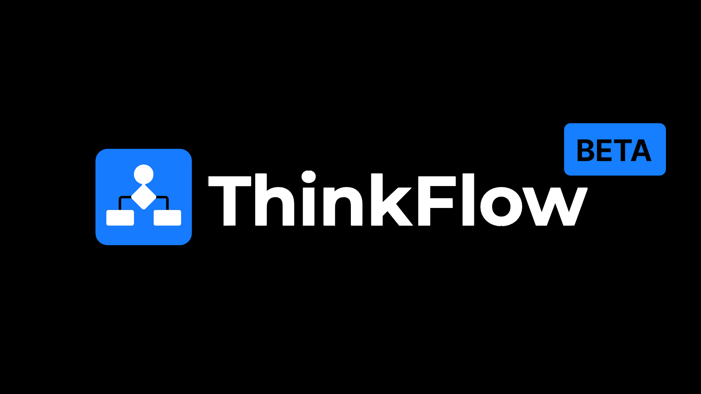

# ThinkFlow AI



[](https://react.dev/) [](https://vitejs.dev/) [](https://tailwindcss.com/) [](https://mermaid.js.org/) 
[](https://gemini.google.com/)

## About

ThinkFlow AI is a web application designed to enable users to create, visualize, and analyze flow diagrams. Powered by the advanced capabilities of **Mermaid.js** and **Google Gemini AI**, ThinkFlow AI transforms natural language descriptions into diagrams instantly.

Whether you are documenting complex system architectures or brainstorming workflows, ThinkFlow provides a free environment equipped with tools like real-time visualization, customizable themes, and comprehensive export options to enhance your productivity.

## Features

- **Diagram Generation**: Generate complex diagrams using Mermaid.js from text descriptions.
- **AI Analysis**: Analyze and explain diagrams using Google Gemini API.
- **Export Options**: Download diagrams as SVG, PNG, or JPG.
- **Fullscreen Mode**: Edit and view diagrams in distraction-free fullscreen mode.
- **Slideshow Mode**: Present diagrams effectively with slide navigation.
- **Real-time Updates**: Instant visual feedback on diagram changes.
- **Undo/Redo**: Easily correct mistakes with full history support.
- **Local Storage Management**: Save progress and clear local storage as needed.

## Supported Diagrams

ThinkFlow AI supports a wide range of diagram types to suit various needs:

- **Flowchart**
- **Sequence Diagram**
- **Class Diagram**
- **State Diagram**
- **Entity Relationship Diagram**
- **User Journey**
- **Gantt**
- **Pie Chart**
- **Quadrant Chart**
- **Requirement Diagram**
- **GitGraph (Git) Diagram**
- **C4 Diagram** (Experimental)
- **Mindmaps**
- **Timeline**
- **ZenUML**
- **Sankey** (New)
- **XY Chart** (New)
- **Block Diagram** (New)
- **Packet** (New)
- **Kanban** (New)
- **Architecture** (New)
- **Radar** (New)
- **Treemap** (New)

## Getting Started

### Prerequisites

- Node.js (v18 or higher)
- npm or yarn

### Installation

1. Clone the repository:
   ```bash
   git clone https://github.com/adityaj08/thinkflow-ai.git
   cd thinkflow-ai
   ```

2. Install dependencies:
   ```bash
   npm install
   # or
   yarn install
   ```

3. Create a `.env` file in the root directory and add your API keys:
   ```env
   VITE_GEMINI_API_KEY1=your_api_key
   VITE_OPENROUTER_API_KEY=your_api_key
   VITE_AUTH0_DOMAIN=your_auth0_domain
   VITE_AUTH0_CLIENT_ID=your_auth0_client_id
   ```

4. Start the development server:
   ```bash
   npm run dev
   # or
   yarn dev
   ```

The application will be available at `http://localhost:5173`

## Usage

1. Enter your diagram description in the input field.
2. Click "Generate Diagram" or press Enter.

### Keyboard Shortcuts

| Key | Action |
| --- | --- |
| `Space` | Toggle slideshow mode |
| `F` | Toggle fullscreen |
| `←` / `J` | Previous slide |
| `→` / `L` | Next slide |
| `+` / `=` | Zoom in |
| `-` | Zoom out |
| `0` | Reset zoom |
| `D` | Toggle dark mode |
| `S` | Save diagram |
| `T` | Toggle orientation |
| `Ctrl+Z` | Undo |
| `Ctrl+Y` | Redo |

## Contributing

Contributions are welcome! Please feel free to submit a Pull Request.

1. Fork the repository.
2. Create your feature branch (`git checkout -b feature/AmazingFeature`).
3. Commit your changes (`git commit -m 'Add some AmazingFeature'`).
4. Push to the branch (`git push origin feature/AmazingFeature`).
5. Open a Pull Request.

## License

This project is licensed under the MIT License - see the [LICENSE](LICENSE) file for details.

## Recent Changes

### Auto-save with Recovery (Dec 2024)
- Automatic save every 5 minutes to localStorage
- Recovery toast prompt on load showing date/time of last auto-save
- One-click "Recover" button to restore unsaved changes

### Import/Export .mmd Files (Dec 2024)
- Export diagrams as native `.mmd` (Mermaid) files
- Import `.mmd` or `.txt` files via file picker
- Circular action buttons in code editor (Copy, Import, Export, Save)

### Diagram History Panel (Dec 2024)
- Version history overlay in bottom-left of diagram
- Circular buttons showing v1, v2, v3, etc.
- Click to navigate between diagram versions
- Blue ring highlights current version

### AI Expand Diagram (Dec 2024)
- Added AI-powered expand button with sparkle icon (✨)
- Expands diagrams with more nodes, connections, and context
- Adds subgraphs, decision branches, and error handling
- Works with both Gemini and OpenRouter models

### Syntax Highlighting (Dec 2024)
- Added CodeMirror-based code editor with custom Mermaid syntax highlighting
- Color-coded keywords, arrows, strings, comments, and node IDs
- Line numbers and active line highlighting
- Dark/light theme support matching app theme

### Diagram Type Selector & Enhanced AI (Dec 2024)
- Added diagram type selector dropdown with all 23 diagram types
- Integrated syntax reference for improved AI diagram generation
- Enhanced AI prompts with strict syntax pattern enforcement
- Added "New" and "Experimental" tags for diagram types

### UI Improvements (Dec 2024)
- Added theme-aware custom scrollbars for dark/light modes
- Redesigned prompt input with auto-expanding textarea (1-7 rows)
- Added copy diagram to clipboard button with watermark support
- Fixed slideshow mode to properly re-render and show node labels

### Toast & Notifications (Dec 2024)
- Integrated Sonner for toast notifications with glassmorphism styling
- Added promise-based toasts for async operations
- Improved error and success feedback throughout the app

### Model Selector (Dec 2024)
- Added reusable ModelSelector component for AI model selection
- Support for multiple Gemini models (flash, flash-lite, pro)
- Integrated into both prompt input and edit input boxes
- Dynamic model selection passed to API calls

### Bug Fixes & Architecture (Dec 2024)
- Fixed header menu outside click behavior
- Fixed API key toggle selection issue
- Restored undo/redo functionality and fixed redundant rendering
- Refactored diagram logic into separate hooks for better maintainability
- Added keyboard shortcuts hook for improved navigation
- Unified AI calls with `callAI` helper function for cleaner code

## Acknowledgments

- **Mermaid.js** for the amazing diagramming library.
- **Google Gemini** for the AI capabilities.
- All contributors and users of the project.
